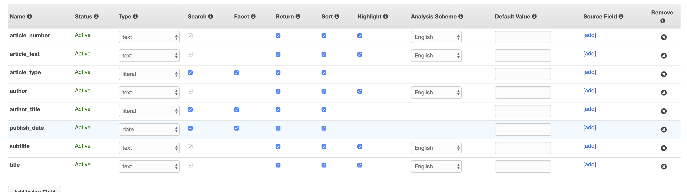

# Cloudsearch schema columns

## Overview
| Name           | Type    |
|----------------|---------|
| article_text   | text    |
| article_type   | literal |
| article_number | text    |
| publish_date   | date    |
| title          | text    |
| subtitle       | text    |
| author         | text    |
| author_title   | literal |

## Field descriptions
todo: talk about the parameters for each field (e.g. is it searchable, etc)

### article_text
the text of the article. searchable & suggestable

### article_type
Either `article` or `advertisement`

## article_number
a string, which can be determined from the first part of the article .txt filename (e.g. `DIVL148` or `MODSMD_ARTICLE7`).

## publish_date
The date that the article was published on

## title
The title of the document. Can be found from the first line of any article/advert file (line beginning with `#`)

## subtitle
the subtitle of the document. Can be found from the second line of any article/advert file (line beginning with `##`)

## author
the author of the document. Can be found from the third line of any article/advert file (line beginning with `###`)

## author_title
the document author's title. Can be found from the third line of any article/advert file (line beginning with `###`). Valid literals include: TODO

## Example data
```python
{
    'type': 'add', 
    'id': '1901-12-20T12:00:00ZarticleMODSMD_ARTICLE9', 
    'fields': {
        'article_text': 'General Alger is ...', 
        'article_type': 'article', 
        'article_number': 'MODSMD_ARTICLE9', 
        'title': 'News of the World.', 
        'subtitle': '', 
        'author': '', 
        'author_title': '', 
        'publish_date': '1901-12-20T12:00:00Z'
    }
}
```


## aws index configuration

Note: highlighting is on, to enable highlights.


## Resources
- [Index Field](https://docs.aws.amazon.com/cloudsearch/latest/developerguide/configuring-index-fields.html) - description of each of the types of index fields.